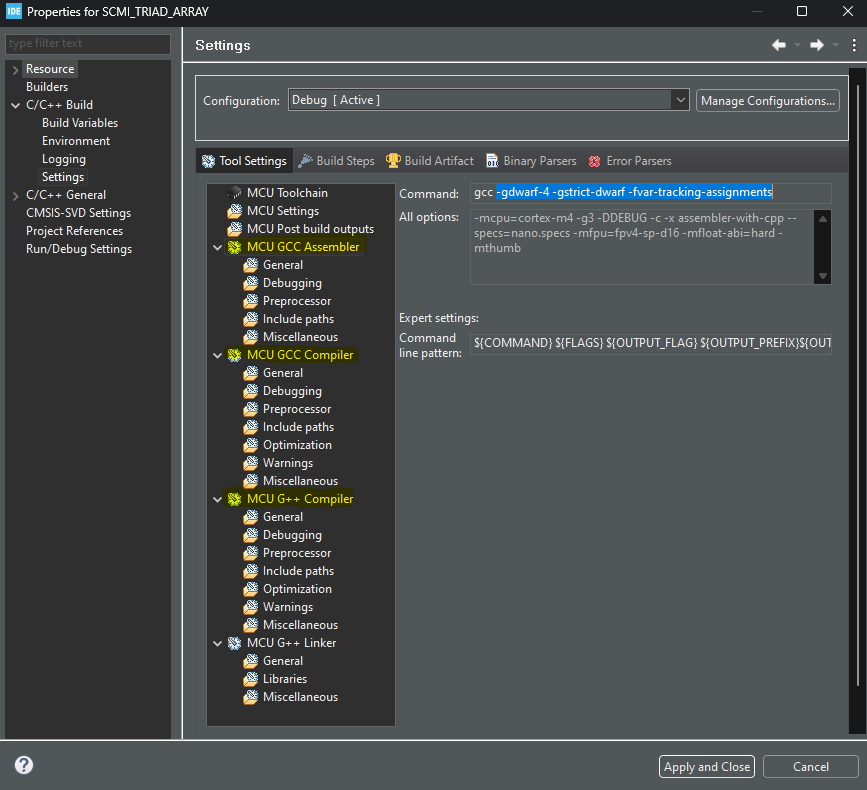

# Instrucciones para hacer Cross-Debugging
**Objetivo:** poder depurar la aplicación compilada en el STM32CubeIDE (via `gcc`) en el Keil uVision.

## Setup STM32CubeIDE
Desde el lado del STM32CubeIDE es necesario agregar las siguientes flags de compilación: `-gdwarf-4 -gstrict-dwarf -fvar-tracking-assignments`. Esto se debe a que versiones nuevas del STM32CubeIDE (posteriores a la 1.11.2) usan `gcc11`, el cual genera información de debug en formato DWARF 5 y no está soportada aun por Keil. Con estas flags forzamos al compilador a que genere los símbolos de debug usando DWARF 4.

Para poder agregar estas flags desde el STM32CubeIDE:

* Hacer click secundario en el proyecto e ir a `Project Properties (Alt + Enter)`.

* Una vez dentro de las propiedades se debe ir a `C/C++ Build` -> `Settings` -> `Tool Settings` -> `MCU GCC Compiler`

* En esta sección se verá un Line Edit con la leyenda `Command`, el cual originalmente dice `gcc`. Es allí donde se debe agregar `-gdwarf-4 -gstrict-dwarf -fvar-tracking-assignments`. Ver capura de pantalla.

* Una vez hecho este cambio, hacer click en `Apply` y luego en `Apply and Close`.



Solo resta hacer un clean build del proyecto, y de esta manera se genera un binario `.elf` listo para ser debuggeado en el Keil uVision.

## Setup Keil uVision
Desde el lado del Keil uVision se necesita generar un proyecto vacío en algón directorio (también vacío). Una vez creado, la estructura del directorio será similar a la siguiente:
```
.
├── DebugConfig
├── EventRecorderStub.scvd
├── <project_name>.uvguix.<username>
├── <project_name>.uvoptx
├── <project_name>.uvprojx
├── Listings
└── Objects
```

Para poder depurar el binario generado son necesarias tres cosas:

1. El binario propiamente dicho (extensión `.elf`)
2. Los archivos de objeto (extensión `.o`)
3. El código fuente (extensión `.c`).

Para simplificar los pasos, se recomienda copiar y pegar el directorio del proyecto del `STM32CubeIDE` dentro del directorio `Objects`

Una vez movido el contenido a `Objects`, es necesario configurar el proyecto. Para ello es necesario ir a `Project` -> `Options for Target...` (Alt + F7)

### Pestaña `Output`


Aquí es necesario especificar dónde se encuentran los objetos. Para ello se debe ir a `Select Folder for Objects...` y desplazarse hasta el directorio donde se encuentran los archivos `.o` y el `.elf`. Asumiendo que la salida del STM32CubeIDE se encuentra en el directorio `Debug`, se debe ir hasta allí.

Por otro lado, se debe cambiar el `Name of Executable` para que coincida con el `.elf` generado.

### Pestaña `Debug`


Aquí se debe configurar en primera instancia el debugger a utilizar (ya sea el ST-Link o el ULINK Pro).
Luego, desde el explorador de Windows se debe ir al directorio del proyecto del Keil y crear un archivo `debug.ini`

Acto seguido, hacer click en `...` en la sección `Initialization File` y seleccionarlo. Hecho esto, se debe cambiar su contenido haciendo click en `Edit...`. Esto abrirá el archivo desde el editor del uVision. Se puede cerrar la ventana `Options for Target...` haciendo click en `OK`

En `debug.ini` deberemos especificar los directorios donde se encuentran los archivos `.c` usando la directiva `SET SRC`. Un ejemplo de esto podría ser:

```
SET SRC = Objects/<project_name>/Core/Src
SET SRC = Objects/<project_name>/Core/Startup
SET SRC = Objects/<project_name>/Drivers/STM32F4xx_HAL_Driver/Src
```

Luego de agregar todos los directorios, se guarda el archivo y el proyecto se encuentra listo para ser debuggeado! Para iniciar una sesión de Debug se puede hacer click en el íconoi de la lupa con la 'd' roja, o bien apretar Ctrl + F5