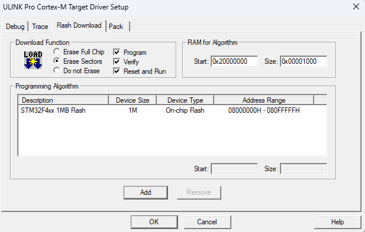
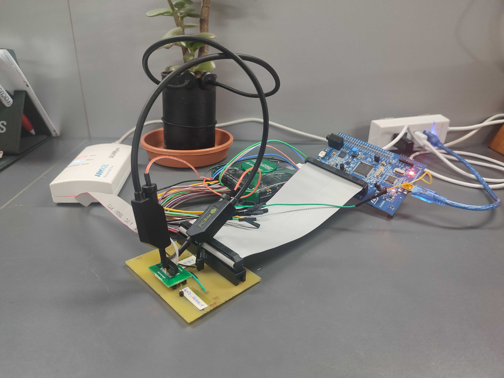

#  Introducción

Este README proporciona una guía detallada para configurar y automatizar el proceso de inyección de fallas en el desarrollo de software para STM32F407 utilizando el ULINKpro y Keil uVision. Describe los pasos necesarios para establecer la conexión de hardware, migrar programas entre entornos de desarrollo, y configurar herramientas para la inyección y medición de fallas. Además, aborda las limitaciones de los IDEs CubeIDE y Keil uVision, proponiendo soluciones y estrategias para superarlas. El README también incluye resultados de pruebas de inyección de fallas y mediciones de tiempos, así como referencias útiles para la configuración y uso de las herramientas.

## Tabla de Contenidos
1. [Objetivo](#objetivo)
2. [Partes del Sistema](#partes-del-sistema)
3. [Arquitectura del Sistema](#arquitectura-del-sistema)
4. [Buildeame!](#buildeame)
5. [Limpiar carpeta `build`](#limpiar-carpeta-build)
6. [Instrucciones de Ejecución](#instrucciones-de-ejecución)

# Setup entorno de desarrollo

## Hardware

- STM32F407-DISC1
- ULINKpro
- Adaptador de conector ETM + Debug 20-pin a placa STM32 


## Automatización de inyección de fallas

La automatización de la inyección de fallas, en este caso, se realiza en un entorno Windows debido a las herramientas disponibles. El proceso implica una secuencia de ejecución que comienza con un script en Python, seguido de un archivo batch (.bat) y finalmente un script de debug (.ini). Aunque Python no es obligatorio en este momento, su inclusión podría brindar funcionalidades adicionales en el futuro.

Para garantizar que el proceso funcione correctamente en cualquier PC, es importante proporcionar una guía paso a paso para modificar los paths en los diferentes componentes:

1. **Script de Python**:
   - Se debe asegurar que las rutas especificadas dentro del script de Python sean relativas o absolutas según sea necesario para ubicar los archivos de manera correcta.

2. **Archivo .bat**:
   - Al modificar el archivo .bat, es crucial actualizar la ruta del archivo UV4.exe para que coincida con la ubicación de este archivo en la PC donde se ejecutará el proceso.

3. **Script uVision**:
   - Dentro del script de configuración .ini, se deben ajustar las rutas según sea necesario para asegurar que los archivos y recursos requeridos por uVision se encuentren en ubicaciones accesibles.
 

### Guía

**Set up del entorno de inyección de fallas**

1. Conectar la placa STM32F407, utilizando los jumpers para asegurar que esté utilizando el debugger incorporado en la placa.

2. Seguir los pasos para migrar el programa de CubeIDE hacia Keil uVision.

3. Desconectar jumpers de debugger y conectar ULINKpro con su adaptador.

4. Crear un entorno virtual de conda para usar los cripts de python.

5. coverage y herramienta a instalar...

**Correr el programa**

1. En los archivos *uVision_flash_debug.py* y *uVision_flash_debug.bat*, se debe actualizar la ruta del archivo *UV4.exe* para que corresponda con la ubicación en la PC donde se esté utilizando.

...

10. Se obtienen los archivos log, trace, ... en la carpeta Output_data.


[//]: # (a veces me pasa que al no me deja flashear porque otro proceso está usando la aplicación (o algo así) y la solución es desenchufar y enchufar la placa. )

### Desarrollo de adaptador para ULINKpro

...

## Uso de los IDEs Keil uVision y STM32 Cube

El objetivo es obtener el trace del programa durante su ejecución. Sin embargo, el debugger integrado en la placa STM32F407-DISC1 no proporciona esta capacidad, lo que plantea un problema significativo. La solución a este inconveniente es el uso del debugger ULINKpro ArmKeil, debido a su capacidad para obtener un rastreo detallado y preciso del programa en ejecución.

No obstante, surge un segundo problema: CubeIDE, el entorno de desarrollo utilizado, no es compatible con el debugger ULINKpro. En este sentido, la solución consiste en emplear el IDE uVision de Keil, único entorno compatible con el debugger ULINKpro. Esto permite obtener el rastreo necesario para el desarrollo y el debug del programa de manera eficiente.

uVision ofrece la posibilidad de utilizar algunas de sus herramientas desde la línea de comandos de Windows, como se detalla en la [documentación oficial](https://developer.arm.com/documentation/101407/0539/Command-Line). Sin embargo, es importante destacar que estos comandos no incluyen opciones específicas para obtener el trace del programa, lo que limita la capacidad de obtener el trace directamente desde la línea de comandos de Windows.

Ante esta limitación, se determinó que la mejor solución es aprovechar un script de debug en uVision. Este enfoque se basa en el [siguiente tutorial](https://www.keil.com/appnotes/files/apnt_307.pdf). A pesar de que el tutorial está diseñado para el uso con ULINKplus, proporciona una base útil para la implementación de scripts de debug en uVision, lo que resulta de mucha ayuda para resolver la automatización de la inyección de fallas.

### Migrar un programa de CubeIDE a Keil uVision

**Pasos a seguir:**

1. 

2. 

3. 

4. 

### Exportar trace desde línea de comandos

Consulta hacha en el support de ARM:

```
Subject: Exporting trace.csv file from Keil uVision script or command line

Hello ARM community,
I am currently working with Keil uVision and ULINKpro for embedded software development, with the goal of automating tests. I am trying to automate the process of exporting the trace.csv file from within a script or command line, but I haven't been able to find any documentation or resources on how to achieve this.
I have searched through the documentation, application notes, and forums, but I couldn't find any information on exporting the trace.csv file programmatically. Some users have asked similar questions in the past, but unfortunately, they didn't receive any replies.
Could someone please provide guidance on how to export the trace.csv file from a Keil uVision script or command line? Any insights, tips, or workarounds would be greatly appreciated.
Thank you in advance for your help!
Best regards,
Lía 
```

Respuestas:
```
From Kevin Bernhardt - Arm Partner Enablement Group

Lia,

You can use the trace information that appears in the event recorder. 
ER STAT path\filename
see https://developer.arm.com/documentation/101407/0539/Debug-Commands/EventRecorder?lang=en

You can also save information in a GCOV format:
see https://developer.arm.com/documentation/101407/0539/Debug-Commands/COVERAGE/COVERAGE-GCOV-Export

Kind regards,

Kevin

For more support information, documentation, downloads and other useful resources see: https://developer.arm.com/support/
```

```
Hello Kevin,

Thank you for your response and the provided links.

I've reviewed the Event Recorder documentation and the COVERAGE-GCOV-Export feature, but unfortunately, it seems that neither of these options provides the specific trace information I'm looking for.

To clarify, the trace information I'm interested in exporting programmatically is the list of all instructions executed during a test session. This level of detail is crucial for our test automation process, as we need to analyze and validate the execution flow of our embedded software.

Could you please provide further guidance on how to export this specific trace information, if available? Alternatively, if there are other features or methods within Keil uVision or ULINKpro that can capture and export this level of trace detail, I would greatly appreciate any information on how to utilize them for test automation purposes.

Thank you for your assistance and support.
 
Best regards,

Lía Gómez

Focus.uy
```

```
From Kevin Bernhardt - Arm Partner Enablement Group

Lia,

You can use the trace information that appears in the event recorder. 
ER STAT path\filename
see https://developer.arm.com/documentation/101407/0539/Debug-Commands/EventRecorder?lang=en

You can also save information in a GCOV format:
see https://developer.arm.com/documentation/101407/0539/Debug-Commands/COVERAGE/COVERAGE-GCOV-Export

Kind regards,

Kevin
```

* Al momento no se ha logrado exportarlo y no se tiene más información.

## Mover código a RAM

... 

### Guía

...

## Trabajar sin HAL

### Programa dummy

Para trabajar sin uso de una HAL en el programa dummy se copiaron todas las funciones necesarias de la HAL de CubeIDE en los archivos *gcc.c*, *gpio.c* y sus respectivos headerfiles *gcc.h* y *gpio.h*.
Además de asimilarse más a las condiciones del software de la UNAM, permite mayor facilidad en la migración de un programa desarrollado en CubeIDE hacia Keil uVision.

## Medidas de tiempos de ejecución

Se realizó una evaluación sobre la viabilidad de introducir fallas mediante breakpoints (mediante hardware), interrumpiendo el programa, modificando un bit y reanudando la ejecución hasta un punto determinado (n veces en el bucle). Para este propósito, se desarrollaron varios scripts de debug: _time_ref.ini_ y _time_fault.ini_.

- _time_ref.ini_ comienza abriendo un archivo de registro llamado "Test.log". Luego, ejecuta un programa hasta alcanzar un punto específico definido en el archivo "main.c" en la línea 71. Después de alcanzar este punto, detiene la ejecución del programa y cierra el archivo de registro. Durante la ejecución, imprime mensajes indicando el inicio y el final del script. 

- _time_fault.ini_ es similar al archivo _time_ref.ini_. Comienza abriendo un archivo de registro llamado "Test.log". Luego, ejecuta un programa hasta alcanzar un punto específico definido en el archivo "main.c" en la línea 71. Después de alcanzar este punto, inyecta una falla al cambiar el valor en la memoria a partir de la dirección 0x20000004. Posteriormente, detiene la ejecución del programa y cierra el archivo de registro. Durante la ejecución, imprime mensajes indicando el inicio y el final del script.

 Tabla de resultados  (2/2/24) + (8/2/24) - trace desactivado (n=1)

| iter   | T s/falla+salida por bk | T c/falla+salida por bk | T s/falla   | T c/falla  |
|--------|-------------------------|-------------------------|-------------|------------|
| 1      | 3.400 s                 | 3.248 s                 | 3.542 s     | 3.470 s    |
| 2      | 3.342 s                 | 3.307 s                 | 3.426 s     | 3.506 s    |
| 3      | 3.357 s                 | 3.318 s                 | 3.465 s     | 3.508 s    |
| 4      | 3.659 s                 | 3.313 s                 | 3.443 s     | 3.485 s    |
| 5      | 3.204 s                 | 3.363 s                 | 3.425 s     | 3.560 s    |
| 6      | 3.227 s                 | 3.328 s                 | 3.458 s     | 3.540 s    |
| 7      | 3.353 s                 | 3.378 s                 | 3.438 s     | 3.580 s    |
| 8      | 3.470 s                 | 3.365 s                 | 3.381 s     | 3.512 s    |
| 9      | 3.302 s                 | 3.373 s                 | 3.438 s     | 3.430 s    |
| 10     | 3.390 s                 | 3.420 s                 | 3.465 s     | 3.546 s    |
| 11     | 3.360 s                 | 3.395 s                 | 3.384 s     | 3.530 s    |
| 12     | 3.430 s                 | 3.510 s                 | 3.470 s     | 3.548 s    |
| 13     | 3.347 s                 | 3.619 s                 | 3.427 s     | 3.522 s    |
| 14     | 3.357 s                 | 3.298 s                 | 3.443 s     | 3.502 s    |
| 15     | 3.219 s                 | 3.339 s                 | 3.483 s     | 3.560 s    |
| 16     | 3.292 s                 | 3.393 s                 | 3.260 s     | 3.490 s    |
| 17     | 3.337 s                 | 3.284 s                 | 3.303 s     | 3.530 s    |
| 18     | 3.368 s                 | 3.437 s                 | 3.434 s     | 3.511 s    |
| 19     | 3.233 s                 | 3.347 s                 | 3.397 s     | 3.591 s    |
| 20     | 3.393 s                 | 3.256 s                 | 3.423 s     | 3.538 s    |
|**prom**| **3.36435 s**           | **3.3755 s**            |**3.42745 s**|**3.5205 s**|

* Para los resultados de las dos primeras columnas se utilizó un programa con un loop infinito y un breakpoint para detener la ejecución. Para las dos columnas siguientes se utilizó un programa con un loop de 3 iteraciones.

Además, para distinguir la inyección de fallas en una misma línea de código en función de la vez que se ejecutó, se busca establecer un breakpoint en la n-ésima iteración a través de esa línea e inyectar la falla. Por lo tanto, la idea es determinar si el retraso en la inyección de la falla aumenta con n. Con este fin, se crearon los scripts _time_ref_n.ini_ y _time_fault_n.ini_.

 Tabla de resultados (2/2/24) - trace desactivado

n = 1000

| Iter   | T s/falla+salida por bk | T c/falla+salida por bk | T s/falla   | T c/falla    |
|--------|-------------------------|-------------------------|-------------|--------------|
| 1      | 66.810 s                | 66.529 s                | 3.982 s     | 66.509 s     |
| 2      | 66.435 s                | 66.303 s                | 3.551 s     | 66.947 s     |
| 3      | 66.153 s                | 66.381 s                | 3.503 s     | 66.678 s     |
| 4      | 66.301 s                | 66.011 s                | 3.466 s     | 66.560 s     |
| 5      | 66.799 s                | 65.100 s                | 3.491 s     | 66.950 s     |
|**prom**| **66.4996 s**           | **66.2648 s**           | **3.5986 s**| **66.7288 s**|

* Para los resultados de las dos primeras columnas se utilizó un programa con un loop infinito y un breakpoint para detener la ejecución. Para las dos columnas siguientes se utilizó un programa con un loop de 1002 iteraciones.

A continuación se presentan los resultados de inyectar fallas en la n-ésima iteración, en el programa Dummy de 1002 iteraciones.

| iter \ n   | 1           | 10          | 100         | 1000         |
|------------|-------------|-------------|-------------|--------------|
| 1          | 3.427 s     | 3.918 s     | 9.623 s     | 66.509 s     |
| 2          | 3.516 s     | 4.054 s     | 9.950 s     | 66.947 s     |
| 3          | 3.441 s     | 3.880 s     | 9.582 s     | 66.678 s     |
| 4          | 3.450 s     | 4.048 s     | 9.629 s     | 66.560 s     |
| 5          | 3.452 s     | 4.009 s     | 10.11 s     | 66.950 s     |
| 6          | 3.409 s     | 3.923 s     | 9.665 s     | 66.225 s     |
| 7          | 3.418 s     | 4.007 s     | 9.710 s     | 66.723 s     |
| 8          | 3.371 s     | 4.011 s     | 9.733 s     | 66.913 s     |
| 9          | 3.486 s     | 3.995 s     | 9.752 s     | 67.242 s     |
| **Prom**   | **3.431 s** | **3.972 s** | **9.743 s** | **66.787 s** |

Conclusión: El tiempo que se demora en inyectar la falla aumenta cuando cuando el número de iteración en que se inyecta la falla es mayor (no queda claro en que proporción)

Tabla de resultados  n = 1000 con con trace y GUI activados (2/2/24) 

n = 1000
| Iter   | T s/falla | T c/falla |
|--------|-----------|-----------|
| 1      |   | 264.98 s  |
| 2      |   | 239.25 s  |
| 3      |   | 241.30 s  |
|**prom**|   |           |

Tabla de resultados  n = 1000 con con trace y GUI activados (5/2/24) 

n = 100
| Iter | T s/falla | T c/falla |
|------|-----------|-----------|
| 1    |   | 32.744 s  |
| 2    |   | 31.476 s  |
| 3    |   | 31.710 s  |
| 4    |   | 28.922 s  |
| 5    |   | 31.025 s  |
| 6    |   | 31.851 s  |
| 7    |   | 28.749 s  |
| 8    |   | 29.153 s  |
| 9    |   | 28.834 s  |
|**prom**|   |           |

n = 10
| Iter | T s/falla | T c/falla |
|------|-----------|-----------|
| 1    | 3.751 s   | 6.5042 s  |
| 2    | 3.812 s   | 6.3918 s  |
| 3    | 3.941 s   | 6.2450 s  |
| 4    | 3.777 s   | 6.2572 s  |
| **Prom** | 3.82025 s | 6.34905 s |

* Cuando se quiere inyectar la falla obteniendo el trace dos veces seguidas, en la segunda no detecta más el hardware y hay que desenchufar y enchufar la placa STM32. El programa tampoco queda corriendo luego de salir del debug. 

[//]: # (Ahora antes de irme vi que empezó a correr de nuevo. Lo que se me ocurre es que capaz se queda sacando los datos de trace y demora un rato en poder volver a usarse. )
[//]: # (con n = 1000 y n = 100 se rompe a la primera.)

[//]: # (con n = 10 anda bien las primeras veces perop después deja de andar.)

## Referencias

- [uVision from command line](https://developer.arm.com/documentation/101407/0539/Command-Line)
- [uVision debug commands](https://developer.arm.com/documentation/101407/0539/Debug-Commands?lang=en)
- [Test automation with MDK and ULINKplus](https://www.keil.com/appnotes/files/apnt_307.pdf)
- [gcovr](https://gcovr.com/en/stable/)
- [STMicroelectronics Community Article: How to place and execute STM32 code in SRAM memory with STM32CubeIDE](https://community.st.com/t5/stm32-mcus/how-to-place-and-execute-stm32-code-in-sram-memory-with/ta-p/49528)
- [Event Recorder and Component Viewer](https://www.keil.com/pack/doc/compiler/EventRecorder/html/er_use.html)

## Anexo

### Relevamiento adaptador del ULink Pro

Del ULink Pro sale un ribbon con 20 cables que va a un conector  Cortex Debug+ETM  (Documentation – Arm Developer) de paso fino (0.05”), y además viene con el bundle un adaptador a 20 pines de paso “estándar” (0.1”). El routeo no es pin a pin (ie pin 1 del conector chico con pin 1 del conector grande, pin 2 con pin 2, etc), por lo que se relevó este adaptador para determinar el enrutamiento de los pines y como resultado se obtuvo la siguiente tabla.

| Cortex Debug+ETM | Descripción      | Adaptador 20 a 20 pines| STM32F4 |
| ---------------- | ---------------- | ---------------------- | ------- |
| 1                | VTref            | 19                     | VCC     |
| 2                | SWIO / TMS       | 13                     | PA13    |
| 3                | GND              | \*                     | GND     |
| 4                | SWDCLK / TCLK    | 11                     | PA14    |
| 5                | GND              | \*                     | GND     |
| 6                | SWO / TDO        | 7                      | PB3     |
| 7                | \-               | \-                     | \-      |
| 8                | NC / TDI         | 15                     | \-      |
| 9                | GNDDetect        | \-                     | \-      |
| 10               | nRESET           | 5                      | NRST    |
| 11               | GND / TgPwr+Cap  | \-                     | \-      |
| 12               | TRACECLK         | 9                      | PE2     |
| 13               | GND / TgtPwr+Cap | \-                     | \-      |
| 14               | TRACEDATA [0]    | \-                     | \-      |
| 15               | GND              | \*                     | GND     |
| 16               | TRACEDATA [1]    | 17                     | PE4     |
| 17               | GND              | \*                     | GND     |
| 18               | TRACEDATA [2]    | 3                      | PE5     |
| 19               | GND              | \*                     | GND     |
| 20               | TRACEDATA [3]    | 1                      | PE6     |

### Configuración Keil uVision





### Adaptador para ULINKpro

#### Primera versión


#### Set-up de relevamiento primera versión



#### Segunda versión 

